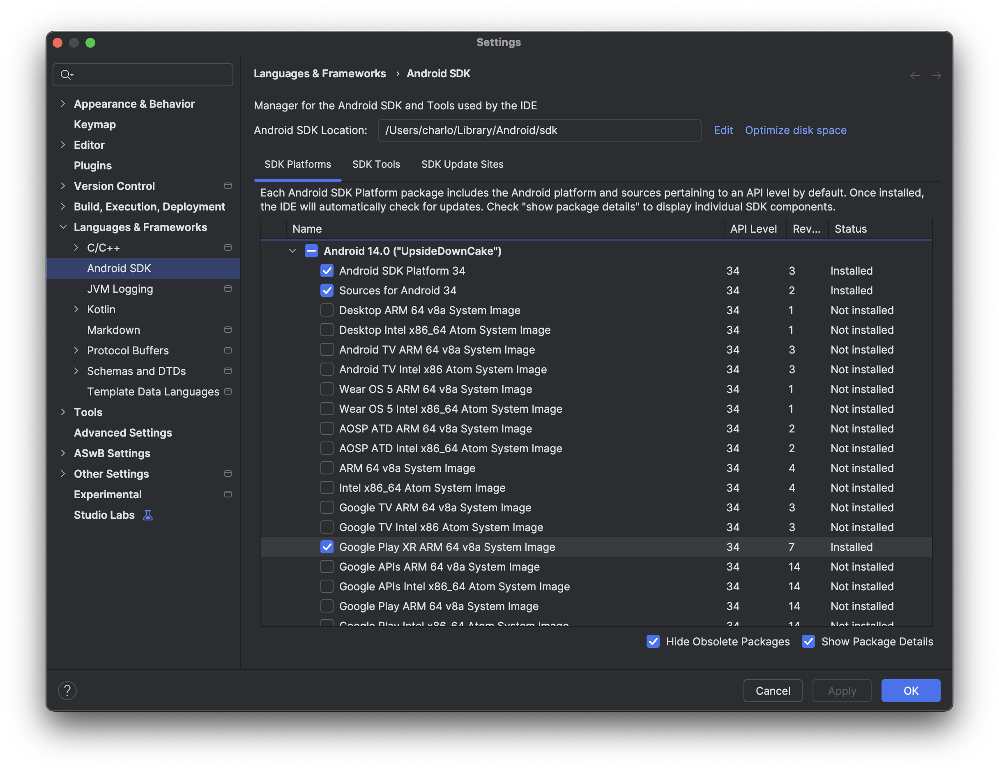
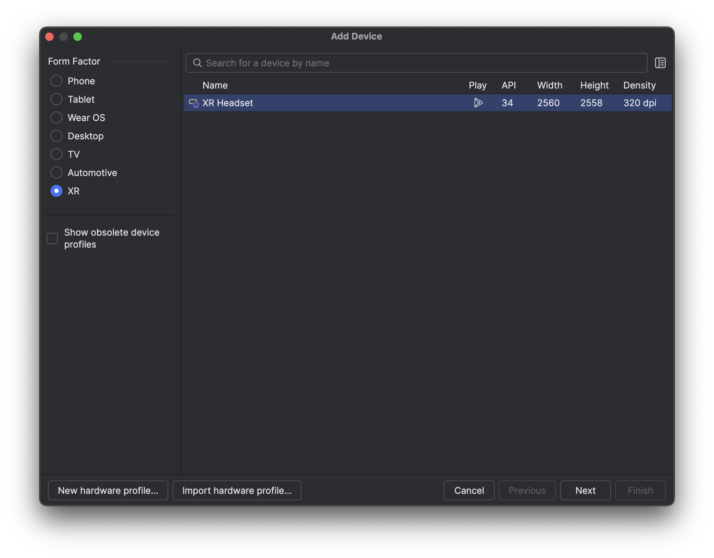

# Jetliner XR

An Android XR project:

> Jetliner in a holding pattern ✈️

<https://charlesmuchene.com/jetliner-xr>

## Attribution

- "a320neo.glb": "A320neo" (https://skfb.ly/oKTUt) by pranav27 is licensed under Creative Commons Attribution (http://creativecommons.org/licenses/by/4.0/).
- "green_hills.glb": [Android XR Codelabs](https://github.com/android/xr-codelabs/blob/fdc8296b397b91a45ea4f4fc2cf0519ca2acc72a/xr-fundamentals/part2/app/src/main/assets/green_hills_ktx2_mipmap.glb)

## Android XR Emulator
To run this project, you'd need an Android XR emulator.

### Install the system image
- On the SDK manager in AS, select the _SDK platforms_ tab and make sure the _Show package details_ box is checked.
- Under the Android 14 section, install the **Android XR ARM 64 v8a** emulator image.

### Create virtual device
- Open _Device Manager_ and select **XR** under the **Category** column.
- Select the _XR Headset_ hardware profile from the list and configure as needed.

## License

See [LICENSE](LICENSE).
